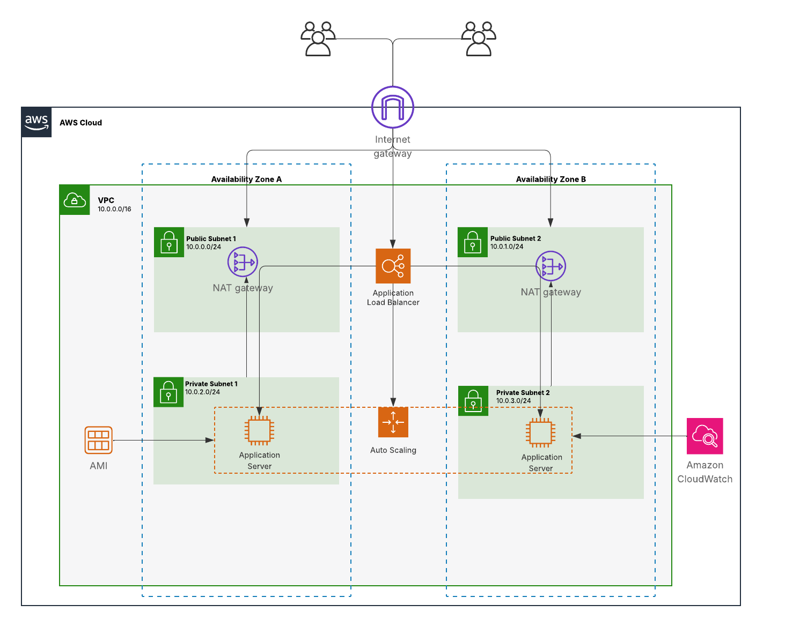

# AWS Scalable Web Architecture with ALB and Auto Scaling

##  Project Overview
This project demonstrates the design and implementation of a highly available, fault-tolerant, and scalable web architecture on Amazon Web Services (AWS). 

Unlike basic CPU-based scaling, this system utilizes **Custom Memory (RAM) Metrics** via CloudWatch Agent and implements **Scheduled Scaling** to proactively handle anticipated traffic spikes (e.g., Holiday Sales) while optimizing infrastructure costs (Cost Optimization).

##  Architecture



### Core Components
- **Network:** Amazon VPC (Multi-AZ), Public/Private Subnets, NAT Gateway for secure outbound traffic.
- **Compute:** EC2 Instances (Amazon Linux) configured via Launch Templates.
- **Traffic Distribution:** Application Load Balancer (ALB) with Target Groups.
- **Scaling Mechanism:** Auto Scaling Group (ASG) with Dynamic Step Scaling and Scheduled Actions.
- **Observability:** Amazon CloudWatch (Alarms & Custom Metrics).

## 🛠️ Advanced Features Implemented

1. **Memory-Based Auto Scaling:** - Configured CloudWatch Agent on EC2 instances to track custom `mem_used_percent` metrics.
   - Set up Step Scaling policies to automatically launch new instances when RAM usage exceeds **60%**.
2. **Scheduled Scaling (Cost Optimization):**
   - Implemented proactive scaling actions (`Holiday-Sale-Start` and `Holiday-Sale-End`) to pre-warm the system before traffic spikes and automatically terminate unused instances after the event.
3. **High Availability:** - Deployed across multiple Availability Zones to eliminate single points of failure.

##  Load Testing Results

The system's resilience was verified using Apache Benchmark (`ab`) to simulate high concurrent user traffic.

**Command executed:**
```bash
ab -n 1000 -c 100 http://<load-balancer-dns>/cafe
```
Result:

1000 total requests

100 concurrent users

0 failed requests

The Auto Scaling Group dynamically launched new instances during high load to maintain stable response times.

## Repository Structure
aws-load-balancing-auto-scaling/
├── architecture/
│   └── architecture-diagram.png
├── reports/
│   └── Report_AWS.pdf
├── screenshots/
│   ├── auto-scaling-group.png
│   ├── cloudwatch-monitor.png
│   ├── load-balancer.png
│   ├── target-group.png
│   └── load-test-result.png
└── README.md
Author

Nguyen Đang Khoa
Cloud Operations / Network Engineering
Email: khoadapoet1102@gmail.com